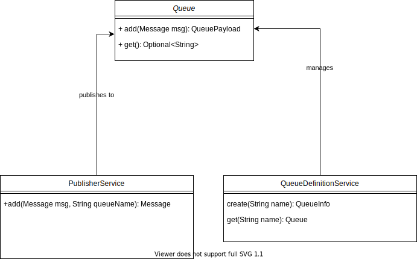

# Problem statement
* Developing a message queueing system.
* Functional requirements of this system have been described below.
* Create your own queue that will hold messages in the form of JSON(Standard library with queue implementation were not allowed).
* There can be more than one queue at any given point of time.
* There will be one publisher that can generate messages to a queue.
* There are multiple subscribers that will listen to queues for messages.
* Subscribers should not be tightly coupled to the system and can be added or removed at runtime.
* When a subscriber is added to the system, It registers a callback function which makes an API call to the given end point with the json payload, this callback function will be invoked in case some message arrives.
###Bonus:
* There must be a retry mechanism for handling error cases when some exception occurs in listening/processing a message, that must be retried.

#Service Model


# Getting Started
* Start the application
    * `gradle build` (Make sure you've gradle-6.8+ version for spring-boot compatibility)
    * No external database required, since it uses H2
    * `gradle bootRun`

* Access swagger at http://localhost:9081/swagger-ui/#/
* Create queue:
    *  `curl --location --request POST 'localhost:9081/v1/admin/queue/test'`
* Subscribe to the queue:
```    
curl --location --request POST 
      'http://localhost:9081/v1/subscribe/' \
      --header 'Content-Type: application/json' \
      --data-raw '{
          "name": "nitin",
          "queueName": "test",
          "callbackDetails": {
              "method": "POST",
              "endpoint": "http://localhost:9081/v1/dummy",
              "headers": {
                "API-KEY": "dusaida312#@"
              }
          }
      }'
```
* Send message with unique request-ID

```
curl --location --request POST 
    'localhost:9081/v1/queue/test' \
    --header 'Content-Type: application/json' \
    --data-raw '{
        "message": "{\"name\":\"aparajaita\"}",
        "requestId": "ee312312"
    }'
```
* Notice the callback at dummy controller via logs.

* Alternatively, you can run cucumber tests at `test/resources/test.feature` via Intellij
  * `CLI` run is `TODO`


### Reference Documentation
For further reference, please consider the following sections:

* [Official Gradle documentation](https://docs.gradle.org)
* [Spring Boot Gradle Plugin Reference Guide](https://docs.spring.io/spring-boot/docs/2.5.4/gradle-plugin/reference/html/)
* [Create an OCI image](https://docs.spring.io/spring-boot/docs/2.5.4/gradle-plugin/reference/html/#build-image)
* [Spring Data JPA](https://docs.spring.io/spring-boot/docs/2.5.4/reference/htmlsingle/#boot-features-jpa-and-spring-data)

### Guides
The following guides illustrate how to use some features concretely:

* [Accessing Data with JPA](https://spring.io/guides/gs/accessing-data-jpa/)

### Additional Links
These additional references should also help you:

* [Gradle Build Scans – insights for your project's build](https://scans.gradle.com#gradle)

